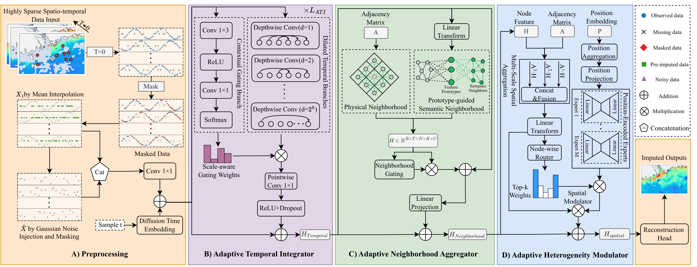

# STAD-Imputer

**STAD-Imputer: A Spatio-Temporal Adaptive Diffusion Framework for Highly Sparse Remote Sensing Data Imputation**

> Remote-sensing variables are essential for monitoring coastal marine ecosystems,
> yet frequent cloud contamination often causes extreme data sparsity with
> missing rates exceeding 90%. **STAD-Imputer** is a unified conditional diffusion
> framework that addresses this challenge through three adaptive modules –
> **ATI**, **ANA**, and **AHM**.

---

## 1. Method Overview

## 2. Architecture



---

## 3. Installation

```bash
# Recommended: create a fresh conda environment
conda create -n stad python=3.9 -y
conda activate stad

# Install dependencies
pip install -r requirements.txt
```

---

## 4. Datasets

All data used in this work are publicly available through online sources. The chlorophyll-a observation datasets were 8-day averaged Level 3 mapped products from Moderate Resolution Imaging Spectroradiometer (MODIS) Aqua projects with a spatial resolution of 4 km. You can select the data with `*.8D.*.4km.nc` as filter.

We also uploaded the datasets on Zenodo at **https://doi.org/10.5281/zenodo.14724760**. Then,

```bash
mv data.zip /path/to/STAD-Imputer/
mkdir /path/to/STAD-Imputer/data
unzip data.zip -d /path/to/STAD-Imputer/data
```

### Remote-Sensing Datasets
- **SST4** (Sea Surface Temperature)
- **PAR** (Photosynthetically Active Radiation)
- **Chl-a** (Chlorophyll-a)

---

## 5. Quick Start

### Datasets (SST4 / PAR / Chl-a)

```bash
# SST4 (Pearl River Estuary)
python train.py \
    --data_root /path/to/zone_sst4_data \
    --area PRE \
    --datasets_type sst4 \
    --epochs 500 \
    --batch_size 1 \
    --missing_ratio 0.9 \

# PAR
python train.py --data_root /path/to/zone_par_data \
                --area PRE --datasets_type par --epochs 500

# Chlorophyll-a
python train.py --data_root /path/to/zone_chla_data \
                --area PRE --datasets_type chla --epochs 500
```

---

## 6. Configuration

| Argument | Default | Description |
|----------|---------|-------------|
| `--missing_ratio` | 0.9 | Fraction of observations randomly masked during training |
| `--num_steps` | 50 | Diffusion denoising steps |
| `--num_samples` | 10 | Monte-Carlo samples at inference |
| `--ATI_tcn_layers` | 2 | Number of stacked ATI blocks |
| `--ATI_dilation_choices` | 1,2,4,8 | Dilation rates for local TCN experts |
| `--ANA_k_phys` | 8 | Physical neighbour count |
| `--ANA_k_feat` | 8 | Semantic neighbour count |
| `--ANA_num_prototypes` | 32 | Number of learnable prototype vectors |
| `--AHM_num_experts` | 8 | Number of sparse spatial experts |
| `--AHM_top_k` | 3 | Top-k expert routing |
| `--AHM_num_scales` | 3 | Graph aggregation scales |
| `--balance_weight` | 0.01 | MoE load-balance loss coefficient |

---

## 7. Evaluation Metrics

At each test epoch the following metrics are reported:

- **[Real]** MAE, RMSE, MAPE (physical units)
- **[Real]** R², SSIM, CRPS

---

## 8. License

This project is released for academic research purposes.
